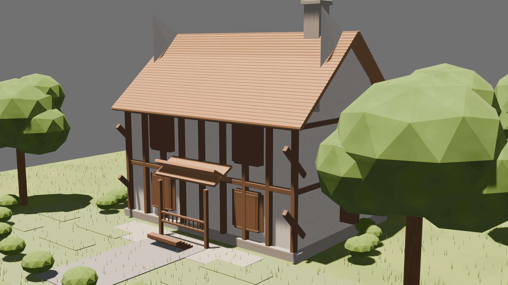

# Dot Discord Kit

**Give this GitHub link to your coding agent. It discovers your setup, recommends the right Dot-to-Discord profile, asks before changing anything, and then verifies the result.**

**코딩 에이전트에게 이 GitHub 링크를 주세요. 에이전트가 환경을 조사하고, 가장 맞는 Dot-to-Discord 프로필을 추천하고, 변경 전에 물어본 뒤, 설정과 검증을 진행합니다.**

## Why this exists

I built this because **OmO냥 (Omonya)** — my Discord-based agent front on top of OmO — turned out to be so convenient that I wanted every other agent I use to work the same way: send a message from Discord on my phone, let the agent do the work on my own machine, and get the result back in the same thread. Dot was the first agent people asked me about, so it is the first connector I'm publishing.

The harness underneath is **[OmO (oh-my-openagent)](https://github.com/code-yeongyu/oh-my-openagent)** by Yeongyu Kim (연규킴, [code-yeongyu](https://github.com/code-yeongyu)). Thanks to that project for making this style of agent workflow possible. This repository copies no code from it; see [`docs/licenses-and-terms.md`](docs/licenses-and-terms.md).

## Roadmap: everything to Discord

Only the **Dot** connector is published and supported today. The same idea — Discord thread in, agent work on your own machine, result back in the thread — is planned for more agents, one connector at a time:

- Pi
- OmO
- Codex
- Claude Code
- Muse AI (muse.ai)

These are plans, not features: none of them ships here yet. Each one will use only that tool's official input path and the same safety model below.

## What this repository is

Dot Discord Kit is an agent-first onboarding kit. It is intentionally not a hosted service and it does not silently install software, read browser credentials, or assume a particular server layout.

```text
GitHub link
  -> your coding agent
  -> redacted local discovery
  -> diagnosis + profile recommendation
  -> your choice and consent
  -> deterministic setup
  -> smoke test + rollback instructions
```

After onboarding you get one Discord channel or thread per topic. You send a message from your phone; your agent works on your own machine; the result — text, image, video, or file — lands back in the same thread, and the agent keeps its own copy in its conversation window. / 온보딩이 끝나면 주제마다 Discord 채널 또는 스레드 하나가 생깁니다. 폰에서 메시지를 보내면 내 컴퓨터에서 에이전트가 작업하고, 결과(텍스트·이미지·영상·파일)가 같은 스레드로 돌아오며 에이전트 대화창에도 같은 사본이 남습니다.

## Quick start

Give your coding agent this repository URL and say:

```text
Read SETUP_PROMPT.md from this repository. Inspect my local setup read-only,
redact secrets, explain the best profile and two alternatives, ask me before
every mutation, then apply only the profile I approve. Never read cookies,
browser profiles, tokens, passwords, or private messages. Stop for Discord
Portal/OAuth/Dot login consent and verify Bot identity and permissions after I
approve. Do not publish anything or install a service without asking me.
```

## Demo / 데모

A real recording: a request typed in Discord, relayed to Dot, modeled and rendered in Blender, and returned to the Discord thread. Waiting periods are sped up; arrivals are shown as they happen. Names are placeholders.

실제 흐름 녹화입니다: Discord에서 요청 입력, Dot으로 전달, Blender 모델링·렌더, Discord 스레드로 결과 반환. 대기 구간만 배속이고 결과가 도착하는 순간은 그대로입니다. 이름은 임시 값입니다.

<p align="center">
  
</p>
<p align="center"><a href="showcase/demo.mp4">Full-quality video (mp4) / 고화질 영상</a></p>

## Profiles

| Profile | Best for | What it does |
| --- | --- | --- |
| `direct-channel` | A simple personal setup | One dedicated Discord channel |
| `persistent-threads` | Most users | One Discord thread per topic |
| `omonya-hybrid` | Existing Omonya users | Omonya owns the parent; Dot owns child threads |
| `local-cdp` | Dot available through local CDP | Bridge-owned text return from a loopback browser lane |
| `devspace-relay` | Server/workspace users | Dot publishes through an explicitly approved DevSpace path |

The recommended default is `persistent-threads` with owner-only access. A Discord thread is a routing/history boundary, not proof of an independent Dot model context.

## Safety model

- Official Discord Bot only; never a user-token/self-bot.
- Discovery is read-only and redacts secrets.
- Discord account/application/guild creation and OAuth consent are human steps.
- The agent explains and asks before installing, editing, enabling, or restarting anything.
- Raw CDP stays loopback-only. Cookies, profiles, tokens, and passwords are never read.
- DevSpace is optional and owner-only unless the connector enforces real scope.
- One route has one result writer: bridge-owned Discord publishing or Dot/DevSpace publishing.
- Unconfirmed sends become `UNKNOWN`; they are never blindly retried.
- File results (images, video, .blend, and similar) are returned as real attachments when the connector can retrieve them; if retrieval is impossible the result is reported as text with the reason stated.
- Every result is delivered twice: to the Discord thread and to the agent's own conversation window, with the same files attached. / 결과 파일은 커넥터가 회수할 수 있으면 실제 첨부로 돌아오고, 불가능하면 이유와 함께 텍스트로 보고합니다. 모든 결과는 Discord 스레드와 에이전트 대화창 두 곳에 같은 파일로 전달됩니다.

## Built with / 함께 쓰는 도구

- **[OmO (oh-my-openagent)](https://github.com/code-yeongyu/oh-my-openagent)** — the recommended agent harness: hand it this repository URL. Its license (Sustainable Use License 1.0) is **not MIT**; see below. / 이 저장소 URL을 넘겨 실행시키는 권장 에이전트입니다. 라이선스는 MIT가 아닙니다.
- **[Agent Messenger](https://github.com/agent-messenger/agent-messenger)** (MIT as declared upstream) — the agent can install it and use **only its official Bot path (`agent-discordbot`)**. The user-token path (`agent-discord`) is Discord self-botting and is forbidden here. / 공식 Bot 경로만 사용하며 사용자 토큰 경로는 금지입니다.
- Nothing from these projects is copied into this repository. Details, caveats, and sources: [`docs/licenses-and-terms.md`](docs/licenses-and-terms.md). / 코드는 복사하지 않았습니다. 자세한 내용과 출처는 위 문서를 보세요.

## Existing Omonya

Read [`docs/omonya-upgrade.md`](docs/omonya-upgrade.md) when Omonya is already installed. The parent `#dot` channel remains Omonya-owned; selected child threads belong to Dot. Retire a legacy relay before enabling another bridge on the same route.

## Showcase

The request below asked Dot to model a house with a garden in Blender and return a best-view photo, a turntable video, and the .blend file. The picture is the real result Dot posted. / 아래 요청은 Dot에게 Blender로 정원 있는 목조주택을 모델링해 베스트 뷰 사진, 턴테이블 영상, .blend 파일로 돌려달라고 한 것이고, 사진은 Dot이 실제로 올린 결과입니다.

<p align="center">
  
</p>

<table>
  <tr>
    <td align="center"><strong>Discord thread / Discord 스레드</strong><br></td>
    <td align="center"><strong>Dot chat / Dot 대화</strong><br></td>
  </tr>
</table>

The captures use placeholder names (Demo User / Dot Bot). Server and channel names, IDs, tokens, and earlier chat history are cropped out or covered. / 캡처는 임시 이름(Demo User / Dot Bot)을 쓰며, 서버·채널 이름, ID, 토큰, 이전 대화는 잘라내거나 가렸습니다.

## Repository map

```text
SETUP_PROMPT.md                 agent-facing onboarding contract
profiles/                       safe profile templates
schemas/                        redacted discovery/diagnosis contracts
examples/                       fictional, privacy-safe fixtures
docs/                           bilingual onboarding, Omonya notes, licenses and terms
tools/privacy-scan.mjs          public-export privacy gate
showcase/                       demo video and preview, result image, chat captures
```


## Local checks

```bash
bun test --pass-with-no-tests
bun run privacy-scan
```

The repository deliberately contains no real Discord IDs, user names, home paths, tokens, cookies, internal endpoints, or private chat captures.

## License

MIT for this kit. See [`LICENSE`](LICENSE). Third-party tools keep their own licenses and terms: [`docs/licenses-and-terms.md`](docs/licenses-and-terms.md). / 이 키트는 MIT이며, 함께 쓰는 도구의 라이선스·약관은 별도입니다.
