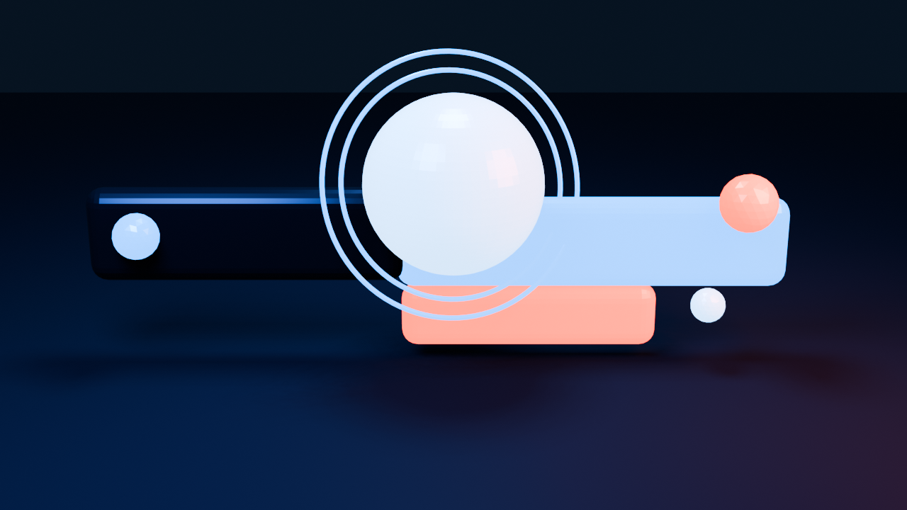
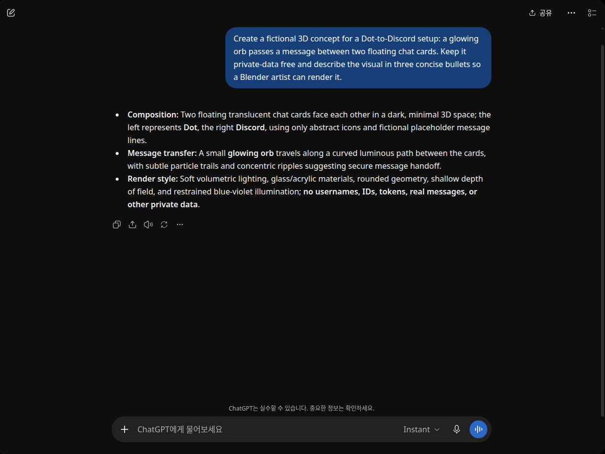
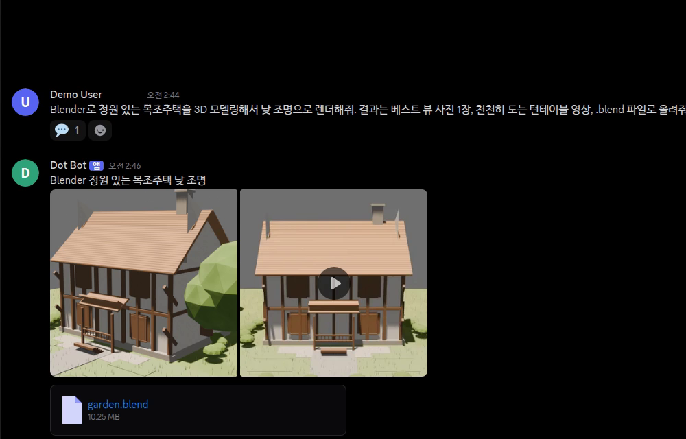

# Dot Discord Kit

**Give this GitHub link to your coding agent. It discovers your setup, recommends the right Dot-to-Discord profile, asks before changing anything, and then verifies the result.**

**코딩 에이전트에게 이 GitHub 링크를 주세요. 에이전트가 환경을 조사하고, 가장 맞는 Dot-to-Discord 프로필을 추천하고, 변경 전에 물어본 뒤, 설정과 검증을 진행합니다.**

## What this repository is

Dot Discord Kit is an agent-first onboarding kit. It is intentionally not a hosted service and it does not silently install software, read browser credentials, or assume a particular server layout.

```text
GitHub link
  -> your coding agent
  -> redacted local discovery
  -> diagnosis + profile recommendation
  -> your choice and consent
  -> deterministic setup
  -> smoke test + rollback instructions
```

## Quick start

Give your coding agent this repository URL and say:

```text
Read SETUP_PROMPT.md from this repository. Inspect my local setup read-only,
redact secrets, explain the best profile and two alternatives, ask me before
every mutation, then apply only the profile I approve. Never read cookies,
browser profiles, tokens, passwords, or private messages. Stop for Discord
Portal/OAuth/Dot login consent and verify Bot identity and permissions after I
approve. Do not publish anything or install a service without asking me.
```

## Profiles

| Profile | Best for | What it does |
| --- | --- | --- |
| `direct-channel` | A simple personal setup | One dedicated Discord channel |
| `persistent-threads` | Most users | One Discord thread per topic |
| `omonya-hybrid` | Existing Omonya users | Omonya owns the parent; Dot owns child threads |
| `local-cdp` | Dot available through local CDP | Bridge-owned text return from a loopback browser lane |
| `devspace-relay` | Server/workspace users | Dot publishes through an explicitly approved DevSpace path |

The recommended default is `persistent-threads` with owner-only access. A Discord thread is a routing/history boundary, not proof of an independent Dot model context.

## Safety model

- Official Discord Bot only; never a user-token/self-bot.
- Discovery is read-only and redacts secrets.
- Discord account/application/guild creation and OAuth consent are human steps.
- The agent explains and asks before installing, editing, enabling, or restarting anything.
- Raw CDP stays loopback-only. Cookies, profiles, tokens, and passwords are never read.
- DevSpace is optional and owner-only unless the connector enforces real scope.
- One route has one result writer: bridge-owned Discord publishing or Dot/DevSpace publishing.
- Unconfirmed sends become `UNKNOWN`; they are never blindly retried.
- File results remain unsupported or metadata-only until byte-level retrieval is proven.

## Built with / 함께 쓰는 도구

- **[OmO (oh-my-openagent)](https://github.com/code-yeongyu/oh-my-openagent)** — the recommended agent harness: hand it this repository URL. Its license (Sustainable Use License 1.0) is **not MIT**; see below. / 이 저장소 URL을 넘겨 실행시키는 권장 에이전트입니다. 라이선스는 MIT가 아닙니다.
- **[Agent Messenger](https://github.com/agent-messenger/agent-messenger)** (MIT as declared upstream) — the agent can install it and use **only its official Bot path (`agent-discordbot`)**. The user-token path (`agent-discord`) is Discord self-botting and is forbidden here. / 공식 Bot 경로만 사용하며 사용자 토큰 경로는 금지입니다.
- Nothing from these projects is copied into this repository. Details, caveats, and sources: [`docs/licenses-and-terms.md`](docs/licenses-and-terms.md). / 코드는 복사하지 않았습니다. 자세한 내용과 출처는 위 문서를 보세요.

## Existing Omonya

Read [`docs/omonya-upgrade.md`](docs/omonya-upgrade.md) when Omonya is already installed. The parent `#dot` channel remains Omonya-owned; selected child threads belong to Dot. Retire a legacy relay before enabling another bridge on the same route.

## Showcase

The Blender render is the visual hero: it is generated from a fictional user request and contains no account or message data. / Blender 렌더를 상단 대표 이미지로 배치했습니다. 가상 사용자 요청으로 만들었으며 계정·메시지 데이터는 없습니다.

<p align="center">
  
</p>
<p align="center"><strong>Blender 3D concept / Blender 3D 콘셉트</strong></p>

Below are the real user-chat and Discord-thread surfaces that inspired the render. Their heights are fixed for a clean comparison. / 아래에는 이 렌더의 콘셉트가 된 실제 사용자 채팅과 Discord 스레드 화면을 같은 높이로 배치했습니다.

<table>
  <tr>
    <td align="center"><strong>User request / 사용자 요청</strong><br></td>
    <td align="center"><strong>Discord thread / Discord 스레드</strong><br></td>
  </tr>
</table>

The chat screenshots are cropped to the conversation area. The render is generated from [showcase/blender-3d-demo.py](showcase/blender-3d-demo.py), and the .blend source is included for inspection. No account names, server/channel names, IDs, tokens, or private messages are included. / 채팅 스크린샷은 대화 영역만 잘랐고, 렌더는 [showcase/blender-3d-demo.py](showcase/blender-3d-demo.py)로 생성했으며 .blend 원본도 포함했습니다. 계정명·서버/채널명·ID·토큰·사설 대화는 포함하지 않습니다.

## Repository map

```text
SETUP_PROMPT.md                 agent-facing onboarding contract
profiles/                       safe profile templates
schemas/                        redacted discovery/diagnosis contracts
examples/                       fictional, privacy-safe fixtures
docs/                           bilingual onboarding, Omonya notes, licenses and terms
tools/privacy-scan.mjs          public-export privacy gate
showcase/                       chat captures, Blender script, blend, and 3D render
```

The two chat images are real UI captures cropped to exclude identities and server details; the hero panel is a Blender render generated from the included source script.

## Local checks

```bash
bun test --pass-with-no-tests
bun run privacy-scan
```

The repository deliberately contains no real Discord IDs, user names, home paths, tokens, cookies, internal endpoints, or private chat captures.

## License

MIT for this kit. See [`LICENSE`](LICENSE). Third-party tools keep their own licenses and terms: [`docs/licenses-and-terms.md`](docs/licenses-and-terms.md). / 이 키트는 MIT이며, 함께 쓰는 도구의 라이선스·약관은 별도입니다.
