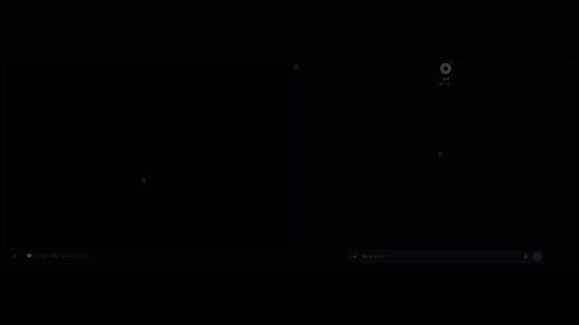

# Everything to Discord

**One Discord thread for every agent.** Send a message from your phone; your agent works on your own machine; the result comes back in the same thread.

**Available now: Dot.** More connectors are on the way.

---

## Why

I run my own agents on my own machines, and the most convenient way to reach them turned out to be Discord: one thread per topic, usable from a phone, with the whole history in one place. This repository is the setup kit that connects an agent to that workflow. Dot is the first connector because it is the one people kept asking about.

The harness underneath is [OmO (oh-my-openagent)](https://github.com/code-yeongyu/oh-my-openagent) by Yeongyu Kim ([code-yeongyu](https://github.com/code-yeongyu)) — the same project that made this style of agent workflow possible. No code is copied from it.

## Quick start

Hand this repository to your coding agent and say:

```text
Read SETUP_PROMPT.md from this repository. Inspect my setup read-only,
explain the best profile and two alternatives, and ask me before every
change. Apply only the profile I approve, then verify the result and
give me rollback steps.
```

Your agent discovers the local setup, recommends a profile, waits for your consent, applies it, and runs a smoke test. Human steps (Discord app and bot creation, OAuth consent, Dot login) are left to you; the agent prepares the links and checks the outcome.

## How it works

```text
you (Discord)  ->  your machine  ->  agent  ->  result back in the thread
```

- **In:** you write in a Discord channel or thread.
- **Work:** the agent runs on your own machine, with your own tools.
- **Out:** text, images, video, or files land back in the same thread, and the agent keeps the same result in its own conversation window.

## Connectors

| Connector | Status | Notes |
| --- | --- | --- |
| **Dot** | Available | The published connector. Setup below. |
| Pi | Planned | Same thread-in, result-out model. |
| OmO | Planned | |
| Codex | Planned | |
| Claude Code | Planned | |
| Muse AI | Planned | |

Planned connectors are not in this repository yet. Each one will follow the same model and be added one at a time.

## Demo

A request typed in Discord, relayed to Dot, modeled and rendered in Blender, and returned to the thread. Waiting periods are sped up; arrivals are shown as they happen.

<p align="center">
  
</p>
<p align="center"><a href="showcase/demo.mp4">Full-quality video</a></p>

## Profiles

| Profile | Best for | What it does |
| --- | --- | --- |
| `direct-channel` | A simple personal setup | One dedicated Discord channel |
| `persistent-threads` | Most users | One thread per topic |
| `omonya-hybrid` | Existing Omonya users | Omonya owns the parent; Dot owns child threads |
| `local-cdp` | Dot reachable through local CDP | Loopback browser lane returns text |
| `devspace-relay` | Server and workspace users | Dot publishes through an approved DevSpace path |

Default: `persistent-threads`, owner-only.

## Repository map

```text
SETUP_PROMPT.md     agent-facing onboarding contract
profiles/           profile templates
schemas/            discovery and diagnosis contracts
examples/           fixtures
docs/               onboarding, upgrade notes, licenses
showcase/           demo video and captures
tools/              local checks
```

## Local checks

```bash
bun test --pass-with-no-tests
bun run privacy-scan
```

## Docs

- [SETUP_PROMPT.md](SETUP_PROMPT.md) — what the agent does, step by step
- [docs/discord-onboarding.ko-en.md](docs/discord-onboarding.ko-en.md) — Discord setup walkthrough
- [docs/omonya-upgrade.md](docs/omonya-upgrade.md) — when Omonya is already installed
- [docs/licenses-and-terms.md](docs/licenses-and-terms.md) — third-party licenses and terms

## License

MIT for this kit. See [LICENSE](LICENSE). Third-party tools keep their own licenses.
