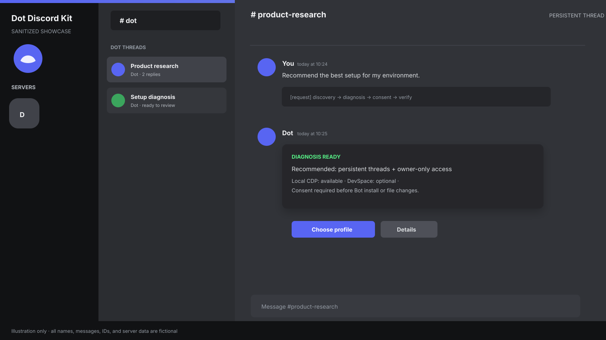

# Dot Discord Kit

**Give this GitHub link to your coding agent. It discovers your setup, recommends the right Dot-to-Discord profile, asks before changing anything, and then verifies the result.**

**코딩 에이전트에게 이 GitHub 링크를 주세요. 에이전트가 환경을 조사하고, 가장 맞는 Dot-to-Discord 프로필을 추천하고, 변경 전에 물어본 뒤, 설정과 검증을 진행합니다.**

## What this repository is

Dot Discord Kit is an agent-first onboarding kit. It is intentionally not a hosted service and it does not silently install software, read browser credentials, or assume a particular server layout.

```text
GitHub link
  -> your coding agent
  -> redacted local discovery
  -> diagnosis + profile recommendation
  -> your choice and consent
  -> deterministic setup
  -> smoke test + rollback instructions
```

## Quick start

Give your coding agent this repository URL and say:

```text
Read SETUP_PROMPT.md from this repository. Inspect my local setup read-only,
redact secrets, explain the best profile and two alternatives, ask me before
every mutation, then apply only the profile I approve. Never read cookies,
browser profiles, tokens, passwords, or private messages. Stop for Discord
Portal/OAuth/Dot login consent and verify Bot identity and permissions after I
approve. Do not publish anything or install a service without asking me.
```

## Profiles

| Profile | Best for | What it does |
| --- | --- | --- |
| `direct-channel` | A simple personal setup | One dedicated Discord channel |
| `persistent-threads` | Most users | One Discord thread per topic |
| `omonya-hybrid` | Existing Omonya users | Omonya owns the parent; Dot owns child threads |
| `local-cdp` | Dot available through local CDP | Bridge-owned text return from a loopback browser lane |
| `devspace-relay` | Server/workspace users | Dot publishes through an explicitly approved DevSpace path |

The recommended default is `persistent-threads` with owner-only access. A Discord thread is a routing/history boundary, not proof of an independent Dot model context.

## Safety model

- Official Discord Bot only; never a user-token/self-bot.
- Discovery is read-only and redacts secrets.
- Discord account/application/guild creation and OAuth consent are human steps.
- The agent explains and asks before installing, editing, enabling, or restarting anything.
- Raw CDP stays loopback-only. Cookies, profiles, tokens, and passwords are never read.
- DevSpace is optional and owner-only unless the connector enforces real scope.
- One route has one result writer: bridge-owned Discord publishing or Dot/DevSpace publishing.
- Unconfirmed sends become `UNKNOWN`; they are never blindly retried.
- File results remain unsupported or metadata-only until byte-level retrieval is proven.

## Existing Omonya

Read [`docs/omonya-upgrade.md`](docs/omonya-upgrade.md) when Omonya is already installed. The parent `#dot` channel remains Omonya-owned; selected child threads belong to Dot. Retire a legacy relay before enabling another bridge on the same route.

## Showcase



This is a deliberately sanitized illustration of the target Discord experience. A real private-server capture was reviewed and excluded because it contained server names, user identity, and internal operational messages.

## Repository map

```text
SETUP_PROMPT.md                 agent-facing onboarding contract
profiles/                       safe profile templates
schemas/                        redacted discovery/diagnosis contracts
examples/                       fictional, privacy-safe fixtures
docs/                           bilingual onboarding and Omonya notes
tools/privacy-scan.mjs          public-export privacy gate
showcase/                       sanitized visual evidence
```

The showcase image is a privacy-redacted preview of the real Discord UI. It is not a transcript of a private server and contains no real message content, names, IDs, or operational data.

## Local checks

```bash
bun test
bun run privacy-scan
```

The repository deliberately contains no real Discord IDs, user names, home paths, tokens, cookies, internal endpoints, or private chat captures.

## License

MIT. See [`LICENSE`](LICENSE).
